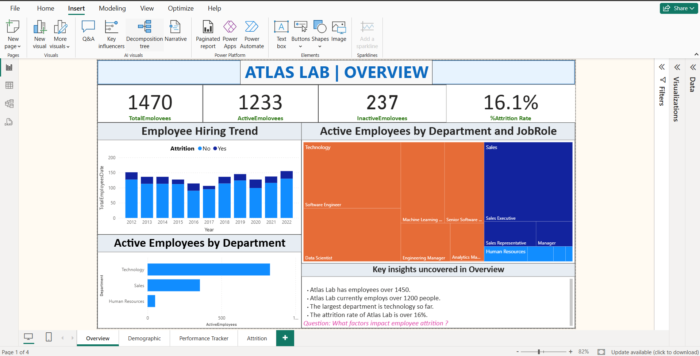
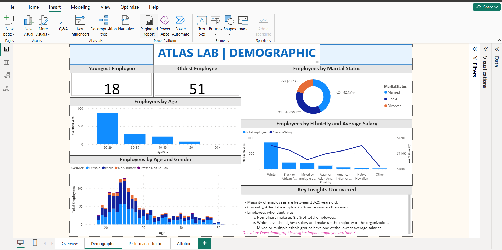
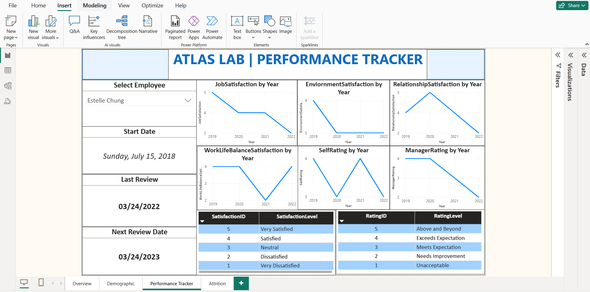
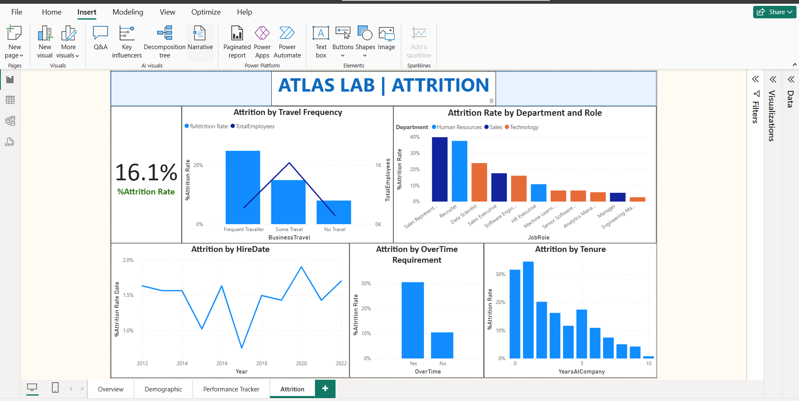

# 📊 HR Analytics Dashboard | Power BI Case Study

This project explores how employee demographics, performance, and work conditions influence attrition within a fictional company — **Atlas Lab**.

The dashboard was built in **Power BI**, focusing on clean visuals, data storytelling, and actionable business insights.

---

## 🚀 Objectives
- Analyze key HR metrics such as headcount, attrition, and satisfaction.
- Identify patterns behind employee turnover.
- Practice data modeling, DAX, and visualization design in Power BI.

---

## 📂 Dashboard Overview
The report consists of four main pages:

1. **Overview** – Summary of total employees, attrition rate, and departmental insights.  
2. **Demographics** – Distribution by age, gender, marital status, and ethnicity.  
3. **Performance Tracker** – Satisfaction and performance trends across roles.  
4. **Attrition Analysis** – Breakdown by travel frequency, overtime, and tenure.

---

## 💡 Key Insights
- Employees with **frequent travel or overtime** tend to have higher attrition rates.  
- Majority of the workforce falls between **20–29 years**, with varying satisfaction across departments.  
- Opportunities exist to improve retention through better workload balance and engagement initiatives.

---

## 🧠 Skills Demonstrated
- Data Modeling & Relationships  
- DAX Measures & Calculations  
- Data Visualization & Storytelling  
- Business Intelligence Reporting  

---

## 🖼️ Dashboard Preview
| Overview | Demographics | Performance Tracker | Attrition |
|-----------|---------------|----------------------|------------|
|  |  |  |  |

---

## 🧩 Tools Used
- **Power BI Desktop**
- **Excel / CSV Dataset**

---

## 📎 How to Use
1. Download or clone this repository.  
2. Open the `.pbix` file in Power BI Desktop.  
3. Explore and interact with the dashboard.  

---

## 🤝 Let’s Connect
I’m currently exploring opportunities in **Data Analytics / Business Intelligence**.  
Feel free to reach out or connect on [LinkedIn](https://www.linkedin.com/in/debjani-sarma-6329a4103/).

---

*Created by Debjani Sarma*  
📧 debjanisarma7@gmail.com  
